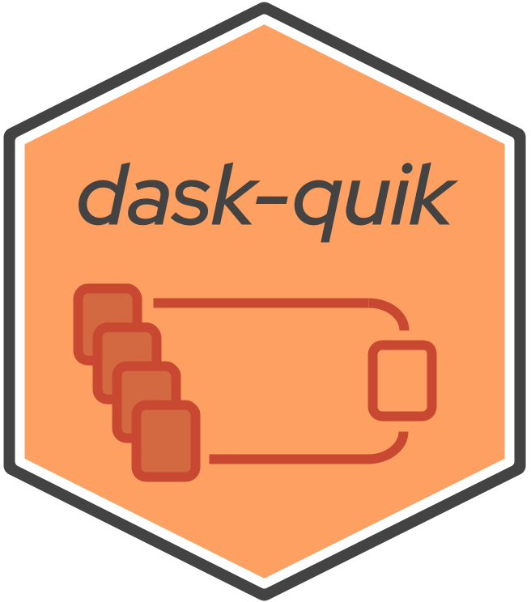

# dask-quik  
Utilities for transforming data using dask and dask_cudf. Most can take either object,
and will still process.

This utility currently has:
- cartesian: The ability to create a sparse matrix of the entire universe of data (creating a cartesian product of your data), and "indexize" your data for future
encoding uses
- combine: a shortcut for a left merge, and the ability to prune rows based on what
should be grouped by, max, min, and/or avg
- dummy: The ability to run just dask functions, using a dask_cudf dummy class
- split: Splitting your train, validation, and testing datasets with test being the
most recent value (for recommendation systems)
- transform: The ability to transform back and forth from pandas, dask, and dask_cudf, and also a workaround to sort by index in dask_cudf
- utils: random utils to setup the dask_cudf cluster, shrink data types when defaulted to 
64-bit, and a quick check if there are available GPUs (using nvidia-smi).