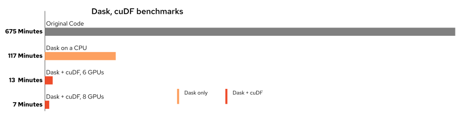

# dask-quik  
Utilities for switching between dask and dask_cudf quik-er

## First, why Dask and/or Dask + cuDF?
[Dask](dask.org) is wonderful, isn't it? The advantages of parallelism with pandas and numpy, lazy computation, saving data as parquet, etc. And, if you have a GPU or two, [RAPIDS cuDF](rapids.ai) is even better, because you get to accelerate that parallelism across GPUs.

Take my project, for example, I was able to gain a wonderful increase of 6x, going from over 11 hours to under 2 hours. But, I also had access to some GPUs, which provided **a gain of 50x with 6 GPUs and 100x with 8 GPUs!**

## Dask-quik lets you use both
If you live in the world of hybrid-cloud, there are going to be times your container is going to be fortunate enough to run on a cluster with GPUs available, and times when they are not. So, your options are:
- build your code only for Dask + cuDF and have it crash when there aren't GPUs (or wait forever for resources)
- build your code only for Dask and miss out on those times you could have 100x
- build and maintain two codesets

Enter **dask-quik**. It's really option three, two codesets, but as streamlined as possible, and transforms your data the dask or dask_cudf way based on available GPUs. Most utilities will take either object, and will still process. 

The library is small for now, and currently contains:
- **cartesian**: The ability to create a sparse matrix of the entire universe of data (creating a cartesian product of your data), and "indexize" your data for future
encoding uses
- **combine**: a shortcut for a left merge, and the ability to prune rows based on what
should be grouped by, max, min, and/or avg
- **dummy**: The ability to run just dask functions, using a dask_cudf dummy class
- **split**: Splitting your train, validation, and testing datasets with test being the
most recent value (for recommendation systems)
- **transform**: The ability to transform back and forth from pandas, dask, and dask_cudf, and also a workaround to sort by index in dask_cudf
- **utils**: random utils to setup the dask_cudf cluster, shrink data types when defaulted to 
64-bit, and a quick check if there are available GPUs (using nvidia-smi).
